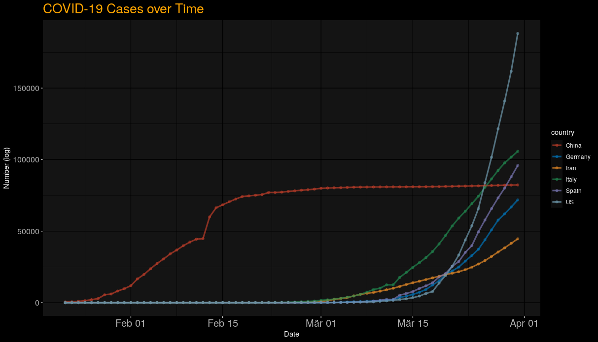
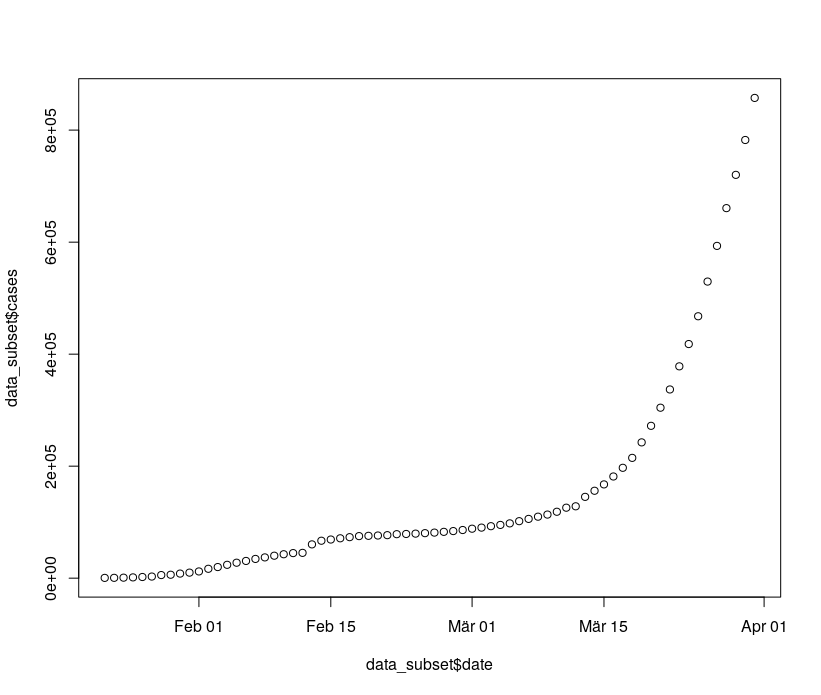
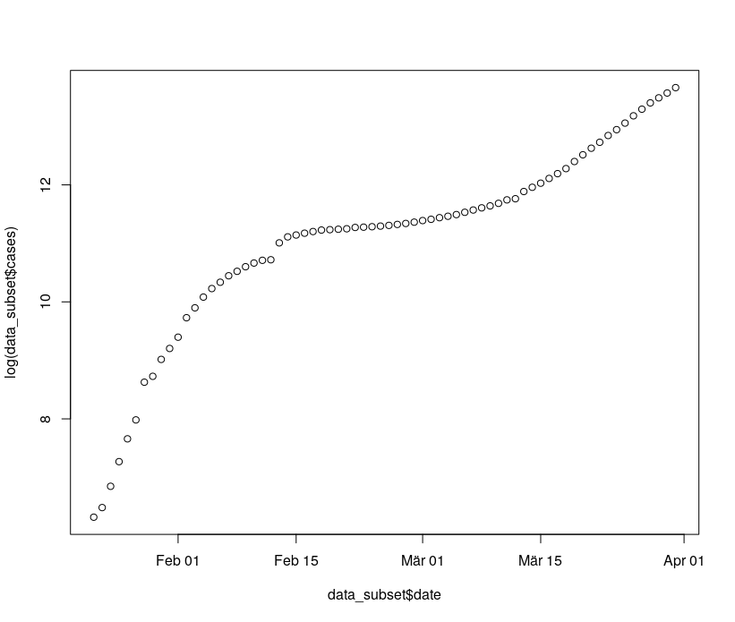
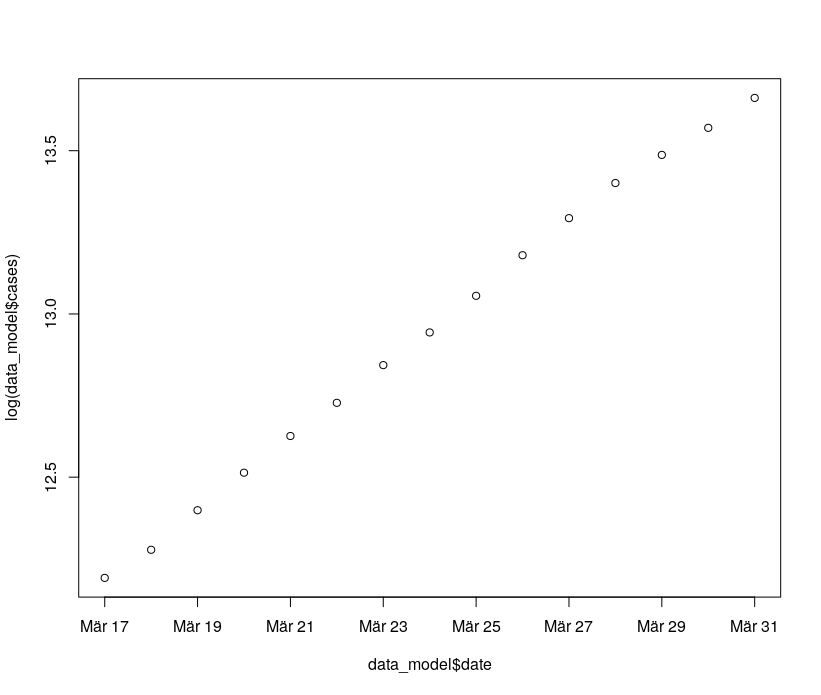
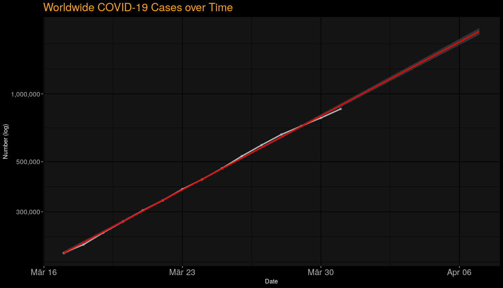
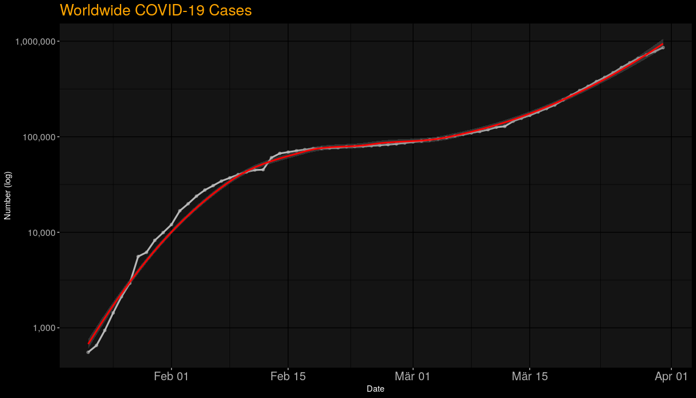
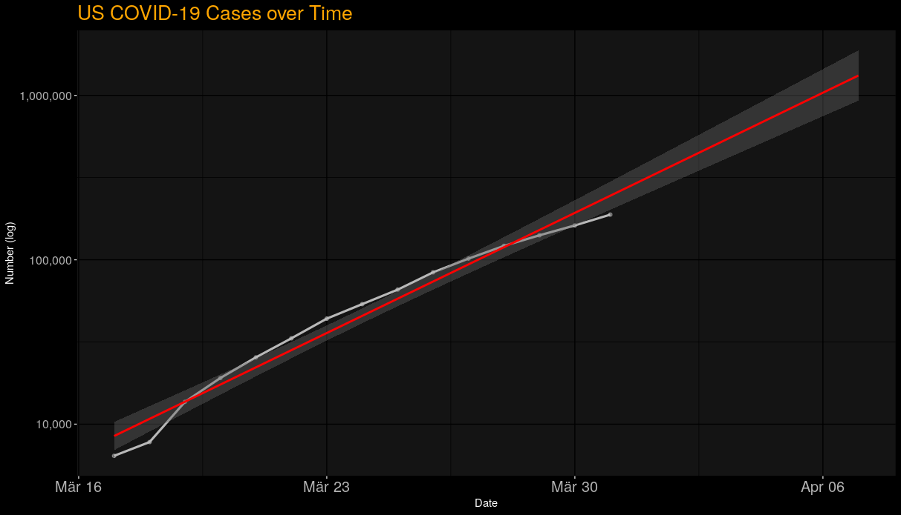
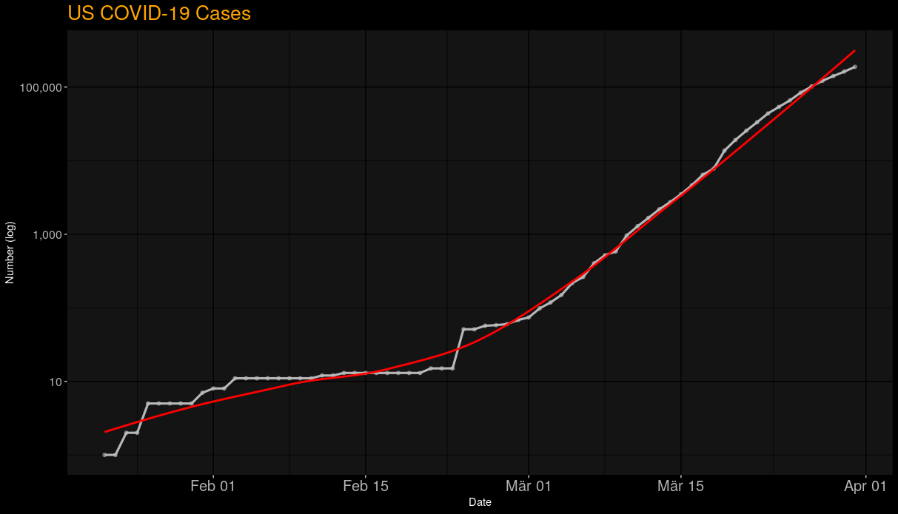

# COVID-19 Analytics of the COVID-19 (Corona) Spread using R


## Goal
The overall goal is to model the COVID-19 spread in order to understand the spread and make (simple) predictions about the future trend of the pandemic. In order to easily model the whole thing, the data is logarithmized so that we can then use a simple linear regression. Building on this, we can then make forecasts for the next few days.

Libraries used:
```r
library(tidyr)
library(data.table)
library(ggplot2)
library(scales)
library(ggsci)
library(ggdark)
```

## 1. PREPROCESSING - DATA PREPARATION

Set the working directory and define a subject, Cases, Deaths or Recovered Cases. These 3 Datasets are provided by the CSSEGISandData Data. he dataset needs some adjustments, cleaning unnecesary variables and transpose from wide to long format.
```r
setwd("~/yourdirectoryhere")

subject = "Cases" # or "Deaths" or "Recovered Cases"

# Load the Dataset 
if (subject=="Cases") {
  data = read.csv("https://raw.githubusercontent.com/CSSEGISandData/COVID-19/master/csse_covid_19_data/csse_covid_19_time_series/time_series_covid19_confirmed_global.csv")
}else if(subject == "Deaths") {
  data = read.csv("https://raw.githubusercontent.com/CSSEGISandData/COVID-19/master/csse_covid_19_data/csse_covid_19_time_series/time_series_covid19_deaths_global.csv")
}else if(subject == "Recovered Cases") {
  data = read.csv("https://raw.githubusercontent.com/CSSEGISandData/COVID-19/master/csse_covid_19_data/csse_covid_19_time_series/time_series_covid19_recovered_global.csv")
}

# The dataset needs some adjustments. Clearing data types:
data$Province.State = as.character(data$Province.State)
data$Country.Region = as.character(data$Country.Region)

#We can remove lat and long since we are not using this geo information here
data$Lat <-  NULL
data$Long <- NULL
# check the data frame
str(data)
```
Structure should look like this:
```r
'data.frame':	256 obs. of  72 variables:
 $ Province.State: chr  "" "" "" "" ...
 $ Country.Region: chr  "Afghanistan" "Albania" "Algeria" "Andorra" ...
 $ X1.22.20      : int  0 0 0 0 0 0 0 0 0 0 ...
 $ X1.23.20      : int  0 0 0 0 0 0 0 0 0 0 ...
 $ X1.24.20      : int  0 0 0 0 0 0 0 0 0 0 ...
```
We need to change the format of the data frame, from wide (columns) to long meaning we want a "date" and a "cases" variable instead of multiple columns for each date. This is calles transpose. This is necesary to make use of the data for later functions and plotting.
What we want is this, the long format:
```r
$ region
$ date
$ cases
```
Using the melt function to transpose the data frame (needs prior transformation to data table format). furthermore, change the variable names to something more "speaking" and remove the X invoked by R (no variable names beginning with a number allowed). Optional, save the new formated data frame for later use ...
```r
data_transformed <- melt(as.data.table(data), id=c("Province.State","Country.Region"), fun="Sum")
# change the variable names to something more "speaking"
names(data_transformed) <-  c("region","country","date","cases")
# remove the X invoked by R (no variable names beginning with a number allowed)
data_transformed$date <- gsub("X", "0", paste(data_transformed$date))
# transform character dates to actual date format
data_transformed$date <- as.Date(data_transformed$date, "%m.%d.%Y")
# This is optional, save the new formatted data frame
write.csv(data_transformed,paste0("covid_19_data_",subject,"_confirmed.csv"),row.names=FALSE)
```
## 2. ANALYTICS
### 2.1 World wide Trend


Aggregate all cases by date -> overall sum over all countries for on date
Aggregated Cases by Date and by Country
```r
data_subset <- aggregate(cases ~ date , data = data_transformed, sum)
data_subset_countries <- aggregate(cases ~ country + date , data = data_transformed, sum)
```

First Impressions -> Plot
We see a strong exponential development from mid of march ...
logarithmize the cases to linearize exponential growth
```r
plot(data_subset$cases ~ data_subset$date)
plot(log(data_subset$cases) ~ data_subset$date)
```




In order to make predictions we will simplify the model and use a simple linear regression model for the timespan the cases grow exponentially. Use the last two weeks for model building.

```r
lastDay <- max(data_subset$date)
# let's use the last two weeks ... 
data_model <- data_subset[data_subset$date >= lastDay-14,]
# check plot ...
plot(log(data_model$cases) ~ data_model$date)

# To understand the regression, it's better to use Day Numbers
# so we can ask later on, what will today plus 7 days look like?
data_model$daynr = seq(1,length(data_model$cases))
# logarithmize the cases to apply linear regression
data_model$casesLog = log(data_model$cases)

# Check the plot ... looks "linear" ?
plot(data_model$casesLog ~ data_model$date)

# Run a simple linear regression
model <- lm(data_model$casesLog ~ data_model$daynr)
# extract Coefficients
a = as.numeric(model$coefficients[1])
b = as.numeric(model$coefficients[2])
```
The timespan plot of the timespan of our regression:


Looks pretty linear ... let's run a regression model and make some predictions


## 2.2 Predictions ... The whole world

Function to predict cases based on our simple model. Since the model is based an logarithmic values <- reverse operation of the values using exp()
```r
predict <- function(day,a,b){
  cases = a + b*day
  return(cases)
}


predict_cases <- function(day,a,b) {
  result = exp(predict(day,a,b))
  return(result)
}
```
Now we can easily set a day and predict cases based on our simple regression
```r
today = length(data_model$daynr)
```

Prediction of our model for today (31st of March as i'm writing this)
```r
predict_cases(today,a,b)
```
800,000 vs 780,000 ... not too bad ...

Prediction of our model for tomorrow, prediction of our model for one week into the future and prediction of our model for two weeks into the future.
```r
predict_cases(today+1,a,b)
# Prediction of our model for one week into the future
predict_cases(today+7,a,b)
# 1,69 Million cases 7th of April :/

# Prediction of our model for two weeks into the future
predict_cases(today+14,a,b)
```

Use ggplot2 to create a diagram of the cases development worldwide and a linear trend
```r
# Plot the model timespan
dateMin = min(data_model$date)
dateMax = max(data_model$date) + 7
ggplot(data_model, aes(x=date,y=cases)) + 
  geom_line(aes(y=cases),size=1.1,alpha=0.7,color="white") + 
  geom_point(aes(y=cases),alpha=0.5,color="grey") + 
  scale_y_log10(labels = scales::comma) + 
  geom_smooth(method = lm, fullrange=TRUE, color="red") +
  ggtitle(paste0("Worldwide COVID-19 ",subject," over Time")) + xlab("Date") + 
  ylab("Number (log)")+
  xlim(dateMin, dateMax) +
  scale_color_nejm() + 
  dark_theme_gray() +
  theme(axis.text.x = element_text(size = 15)) +
  theme(axis.text.y = element_text(size = 12)) +
  theme(plot.title = element_text(size=20,color="orange")) 
  ```
  
  
  Plot for the same data but the whole time range
  ```r
  # Plot the whole date span
ggplot(data_subset, aes(x=date,y=cases)) + 
  geom_line(aes(y=cases),size=1.1,alpha=0.7,color="white") + 
  geom_point(aes(y=cases),alpha=0.5,color="grey") + 
  scale_y_log10(labels = scales::comma) + 
  geom_smooth(method = loess, fullrange=TRUE, color="red") +
  ggtitle(paste0("Worldwide COVID-19 ",subject)) + xlab("Date") + 
  ylab("Number (log)")+
  scale_color_nejm() + 
  dark_theme_gray() +
  theme(axis.text.x = element_text(size = 15)) +
  theme(axis.text.y = element_text(size = 12)) +
  theme(plot.title = element_text(size=20,color="orange")) 
  ```
  

## 2.3 Predictions - Single Countries or Regions
 
Now that we have all set we can use the above data frames to investigate single countries or groups of countries/regions.
Let's start with the united states. We create a list of countries/regions (needle) and filter the data frame. We therefor ecreate a subset of the data frame data_subset_countries using only regions we defined in the needle vector. Now we can run the same operations as above to predict and plot the CVOID-19 spread for specific regions.

```r
# List of regions to investigate
needle = c("US")

# Subset by Country list
data_subset_US = data_subset_countries[which(data_subset_countries$country %in% needle),]

# first impressions
plot(log(data_subset_US$cases) ~ data_subset_US$date)
# exponential growth since beginning of march 
data_model_US <- data_subset_US[data_subset_US$date >= lastDay-14,]
plot(log(data_model_US$cases) ~ data_model_US$date)

# create Day Nr
data_model_US$daynr = seq(1,length(data_model_US$cases))
# logarithmize
data_model_US$casesLog = log(data_model_US$cases)
```


Run the regression the same as before:
```r
# Regression
model_US <- lm(data_model_US$casesLog ~ data_model_US$daynr)
# extrahieren der Koeffizienten
a = as.numeric(model_US$coefficients[1])
b = as.numeric(model_US$coefficients[2])

today = length(data_model_US$daynr)

# Prediction of our model for today, tomorrow, etc (31st of March as i'm writing this)
predict_cases(today,a,b)
predict_cases(today+1,a,b)
predict_cases(today+7,a,b)
predict_cases(today+14,a,b)
```
And use ggplot to create a plot of the covid-19 spread
```r
# Plot the model timespan
dateMin = min(data_model_US$date)
dateMax = max(data_model_US$date) + 7
ggplot(data_model_US, aes(x=date,y=cases)) + 
  geom_line(aes(y=cases),size=1.1,alpha=0.7,color="white") + 
  geom_point(aes(y=cases),alpha=0.5,color="grey") + 
  scale_y_log10(labels = scales::comma) + 
  geom_smooth(method = lm, fullrange=TRUE, color="red") +
  ggtitle(paste0("US COVID-19 ",subject," over Time")) + xlab("Date") + 
  ylab("Number (log)")+
  xlim(dateMin, dateMax) +
  scale_color_nejm() + 
  dark_theme_gray() +
  theme(axis.text.x = element_text(size = 15)) +
  theme(axis.text.y = element_text(size = 12)) +
  theme(plot.title = element_text(size=20,color="orange")) 

# Plot the whole date span
ggplot(data_subset_US, aes(x=date,y=cases)) + 
  geom_line(aes(y=cases),size=1.1,alpha=0.7,color="white") + 
  geom_point(aes(y=cases),alpha=0.5,color="grey") + 
  scale_y_log10(labels = scales::comma) + 
  geom_smooth(method = loess, fullrange=TRUE, se=FALSE, color="red") +
  ggtitle(paste0("US COVID-19 ",subject)) + xlab("Date") + 
  ylab("Number (log)")+
  scale_color_nejm() + 
  dark_theme_gray() +
  theme(axis.text.x = element_text(size = 15)) +
  theme(axis.text.y = element_text(size = 12)) +
  theme(plot.title = element_text(size=20,color="orange")) 
```



